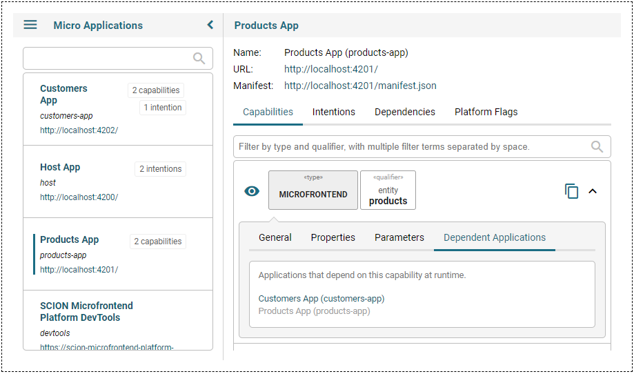

<a href="/README.md"></a>

| SCION Microfrontend Platform | [Projects Overview][menu-projects-overview] | [Changelog][menu-changelog] | [Contributing][menu-contributing] | [Sponsoring][menu-sponsoring] |  
| --- | --- | --- | --- | --- |

## [SCION Microfrontend Platform][menu-home] > [Getting Started][menu-getting-started] > Integrate DevTools

In the previous chapter, we refactored our application to navigate to microfrontends via intent-based routing, making navigation flows explicit because specified in the manifest.

In this chapter we will integrate the SCION DevTools to see which applications depend on each other. The SCION DevTools is a microfrontend that allows inspecting installed micro apps, their intentions and capabilities, and shows dependencies between applications.

<details>
  <summary><strong>Register SCION DevTools micro app</strong></summary>

The SCION DevTools are implemented as a microfrontend that you can integrate analogous to other microfrontends.

Follow the steps below to register the *SCION DevTools* micro app.

1. Open the file `host-app/src/host.ts` of the host app.
2. Register the *SCION DevTools* micro app, as follows:
   ```ts
         public async init(): Promise<void> {
           await MicrofrontendPlatform.startHost({
             applications: [
               {symbolicName: 'products-app', manifestUrl: 'http://localhost:4201/manifest.json'},
               {symbolicName: 'customers-app', manifestUrl: 'http://localhost:4202/manifest.json'},
   [+]         {
   [+]           symbolicName: 'devtools',
   [+]           manifestUrl: 'https://scion-microfrontend-platform-devtools.vercel.app/assets/manifest.json',
   [+]           intentionCheckDisabled: true,
   [+]           scopeCheckDisabled: true,
   [+]         },
             ],
           });
   
           // Install navigation listeners
           document.querySelector('button#products').addEventListener('click', () => {
             Beans.get(OutletRouter).navigate('http://localhost:4201/product-list/product-list.html');
           });
   
           document.querySelector('button#customers').addEventListener('click', () => {
             Beans.get(OutletRouter).navigate('http://localhost:4202/customer-list/customer-list.html');
           });
         }
   ```
   Note that we need to disable some checks for the SCION DevTools to have access to private capabilities. We strongly recommend not to do this for regular micro apps. 
</details>

<details>
  <summary><strong>Declare an intention to open the SCION DevTools microfrontend</strong></summary>

The SCION DevTools provide a microfrontend capability with the following qualifier: `{component: 'devtools', vendor: 'scion'}`.

Like any other micro app, the host app must declare its intentions in its manifest. We can do this inline when starting the SCION Microfrontend Platform, as follows:

1. Open the file `host-app/src/host.ts` of the host app.
2. Create a manifest for the host app and declare the intention to navigate to the SCION DevTools microfrontend. For the host, we can create an inline manifest, as follows:
   ```ts
         public async init(): Promise<void> {
           await MicrofrontendPlatform.startHost({
             applications: [
               {symbolicName: 'products-app', manifestUrl: 'http://localhost:4201/manifest.json'},
               {symbolicName: 'customers-app', manifestUrl: 'http://localhost:4202/manifest.json'},
               {
                 symbolicName: 'devtools',
                 manifestUrl: 'https://scion-microfrontend-platform-devtools.vercel.app/assets/manifest.json',
                 intentionCheckDisabled: true,
                 scopeCheckDisabled: true,
               },
             ],
   [+]       host: {
   [+]         manifest: {
   [+]           name: 'Host App',
   [+]           intentions: [
   [+]             {type: 'microfrontend', qualifier: {component: 'devtools', vendor: 'scion'}},
   [+]           ],
   [+]         },
   [+]       },
           });
   
           // Install navigation listeners
           document.querySelector('button#products').addEventListener('click', () => {
             Beans.get(OutletRouter).navigate('http://localhost:4201/product-list/product-list.html');
           });
   
           document.querySelector('button#customers').addEventListener('click', () => {
             Beans.get(OutletRouter).navigate('http://localhost:4202/customer-list/customer-list.html');
           });
         }
   ```
</details>

<details>
  <summary><strong>Load DevTools into the router outlet</strong></summary>

In the [first chapter][link-getting-started:01:host-app] we added a router outlet at the bottom of the application shell. We will display the SCION DevTools in that outlet.

1. Open the file `host-app/src/host.ts` of the host app.
2. Route the outlet as follows:
   ```ts
         public async init(): Promise<void> {
           await MicrofrontendPlatform.startHost({
             applications: [
               {symbolicName: 'products-app', manifestUrl: 'http://localhost:4201/manifest.json'},
               {symbolicName: 'customers-app', manifestUrl: 'http://localhost:4202/manifest.json'},
               {
                 symbolicName: 'devtools',
                 manifestUrl: 'https://scion-microfrontend-platform-devtools.vercel.app/assets/manifest.json',
                 intentionCheckDisabled: true,
                 scopeCheckDisabled: true,
               },
             ],
             host: {
               manifest: {
                 name: 'Host App',
                 intentions: [
                   {type: 'microfrontend', qualifier: {component: 'devtools', vendor: 'scion'}},
                 ],
               },
             },
           });
   
   [+]     // Display the DevTools
   [+]     Beans.get(OutletRouter).navigate({component: 'devtools', vendor: 'scion'}, {outlet: 'bottom'});

           // Install navigation listeners
           document.querySelector('button#products').addEventListener('click', () => {
             Beans.get(OutletRouter).navigate('http://localhost:4201/product-list/product-list.html');
           });
   
           document.querySelector('button#customers').addEventListener('click', () => {
             Beans.get(OutletRouter).navigate('http://localhost:4202/customer-list/customer-list.html');
           });
         }
   ```
</details>

<details>
   <summary><strong>Open the app in the browser</strong></summary>

We did it! Run `npm run start` to serve the applications and see the DevTools displayed at the bottom.

In the DevTools, open the *Products App* in the application list and click the *ProductList Microfrontend* in the capability list. Open the `Dependent Applications` tab and you should see that the *Customers App* depends on this microfrontend.

</a>

</details>

<details>
   <summary><strong>What we did in this chapter</strong></summary>

In this chapter, we integrated SCION DevTools to inspect micro apps and their dependencies, and to browse the catalog of capabilities.

<details>
   <summary>The <code>host-app/src/host.ts</code> looks as following:</summary>

```ts
import {MicrofrontendPlatform, OutletRouter} from '@scion/microfrontend-platform';
import {Beans} from '@scion/toolkit/bean-manager';

class HostController {

  public async init(): Promise<void> {
    await MicrofrontendPlatform.startHost({
      applications: [
        {symbolicName: 'products-app', manifestUrl: 'http://localhost:4201/manifest.json'},
        {symbolicName: 'customers-app', manifestUrl: 'http://localhost:4202/manifest.json'},
        {
          symbolicName: 'devtools',
          manifestUrl: 'https://scion-microfrontend-platform-devtools.vercel.app/assets/manifest.json',
          intentionCheckDisabled: true,
          scopeCheckDisabled: true,
        },
      ],
      host: {
        manifest: {
          name: 'Host App',
          intentions: [
            {type: 'microfrontend', qualifier: {component: 'devtools', vendor: 'scion'}},
            {type: 'microfrontend', qualifier: {'*': '*'}},
          ],
        },
      },
    });

    // Display the DevTools
    Beans.get(OutletRouter).navigate({component: 'devtools', vendor: 'scion'}, {outlet: 'bottom'});

    // Install navigation listeners
    document.querySelector('button#products').addEventListener('click', () => {
      Beans.get(OutletRouter).navigate('http://localhost:4201/product-list/product-list.html');
    });

    document.querySelector('button#customers').addEventListener('click', () => {
      Beans.get(OutletRouter).navigate('http://localhost:4202/customer-list/customer-list.html');
    });
  }
}

new HostController().init();
```
</details>

</details>

<details>
   <summary><strong>What's next</strong></summary>

   In the next chapter, we will learn how to browse the catalog of capabilities. Click [here][link-getting-started:08:browse-capabilities] to continue. 
</details>

[menu-home]: /README.md
[menu-projects-overview]: /docs/site/projects-overview.md
[menu-changelog]: /docs/site/changelog/changelog.md
[menu-contributing]: /CONTRIBUTING.md
[menu-sponsoring]: /docs/site/sponsoring.md

[menu-getting-started]: /docs/site/getting-started/getting-started.md
[link-getting-started:01:host-app]: 01-getting-started-host-app.md
[link-getting-started:02:products-app]: 02-getting-started-products-app.md
[link-getting-started:03:customers-app]: 03-getting-started-customers-app.md
[link-getting-started:04:microfrontend-routing]: 04-getting-started-microfrontend-routing.md
[link-getting-started:05:embed-microfrontend]: 05-getting-started-embed-microfrontend.md
[link-getting-started:06:navigate-via-intent]: 06-getting-started-navigate-via-intent.md
[link-getting-started:07:devtools]: 07-getting-started-devtools.md
[link-getting-started:08:browse-capabilities]: 08-getting-started-browse-capabilities.md
[link-getting-started:09:summary]: 09-getting-started-summary.md
