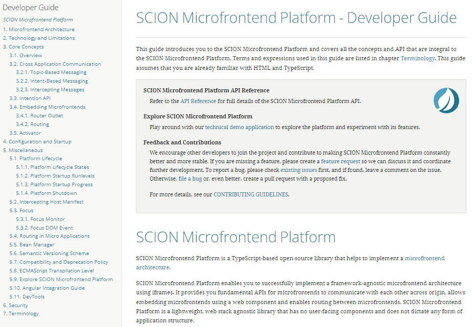

| SCION Microfrontend Platform | [Projects Overview][menu-projects-overview] | [Changelog][menu-changelog] | [Contributing][menu-contributing] | [Sponsoring][menu-sponsoring] |  
| --- | --- | --- | --- | --- |

## [SCION Microfrontend Platform][menu-home] > [Getting Started][menu-getting-started] > Summary

Congratulations! You have just implemented a microfrontend-based architecture with SCION that gives greatest possible isolation between the micro apps involved. Note that we have focused on navigation and the Intention API, but did not cover other topics such as [messaging][link-getting-started:developer-guide:messaging] or [activators][link-getting-started:developer-guide:activator]. You can have a look to [SCION Developer Guide][link-getting-started:developer-guide] if you need more details on specific features.

The source code is available on [Github](https://github.com/SchweizerischeBundesbahnen/scion-microfrontend-platform-getting-started) on the `master` branch.

 

  

[menu-home]: /README.md
[menu-projects-overview]: /docs/site/projects-overview.md
[menu-changelog]: /docs/site/changelog/changelog.md
[menu-contributing]: /CONTRIBUTING.md
[menu-sponsoring]: /docs/site/sponsoring.md

[menu-getting-started]: /docs/site/getting-started/getting-started.md
[link-getting-started:01:host-app]: 01-getting-started-host-app.md
[link-getting-started:02:products-app]: 02-getting-started-products-app.md
[link-getting-started:03:customers-app]: 03-getting-started-customers-app.md
[link-getting-started:04:microfrontend-routing]: 04-getting-started-microfrontend-routing.md
[link-getting-started:05:embed-microfrontend]: 05-getting-started-embed-microfrontend.md
[link-getting-started:06:navigate-via-intent]: 06-getting-started-navigate-via-intent.md
[link-getting-started:07:devtools]: 07-getting-started-devtools.md
[link-getting-started:08:browse-capabilities]: 08-getting-started-browse-capabilities.md
[link-getting-started:09:summary]: 09-getting-started-summary.md

[link-getting-started:developer-guide]: https://microfrontend-platform-developer-guide.scion.vercel.app

[link-getting-started:developer-guide:messaging]: https://microfrontend-platform-developer-guide.scion.vercel.app/index.html#chapter:cross-application-communication
[link-getting-started:developer-guide:activator]: https://microfrontend-platform-developer-guide.scion.vercel.app/index.html#chapter:activator
