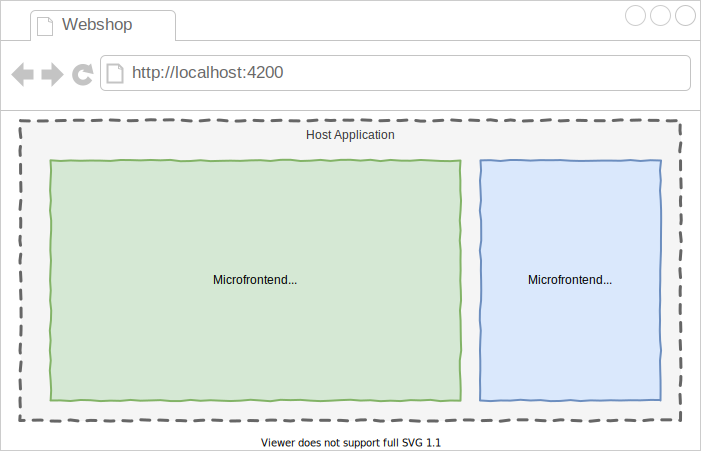

<a href="/README.md"></a>

| SCION Microfrontend Platform | [Projects Overview][menu-projects-overview] | [Changelog][menu-changelog] | [Contributing][menu-contributing] | [Sponsoring][menu-sponsoring] |  
| --- | --- | --- | --- | --- |

## [SCION Microfrontend Platform][menu-home] > Getting Started
This Getting Started Guide introduces you to the essentials of the SCION Microfrontend Platform by developing a simple webshop. The webshop consists of a products page and a shopping cart, both implemented as a microfrontend. The microfrontends are provided by two different micro applications.

<p align="center">
  <a href="https://scion-microfrontend-platform-getting-started.now.sh"></a>
</p>

In total we have 3 applications:

- **Host Application (gray, [localhost:4200](http://localhost:4200))**\
  App which the user loads into his browser that provides the main application layout of the webshop.
- **Products Application (green, [localhost:4201](http://localhost:4201))**\
  Provides the products microfrontend, so that the user can view the products of our webshop.
- **Shopping Cart Application (blue, [localhost:4202](http://localhost:4202))**\
  Provides the shopping cart microfrontend, allowing the user to add products into the shopping cart.

The applications we are developing in this guide are pure TypeScript applications, i.e., they do not depend on a web framework like [Angular][link-angular],  [React][link-react], [Vue.js][link-vuejs], or similar.

 
***

#### How to complete this guide

We recommend cloning the source code repository for this guide. It contains minimal application skeletons to get started straight away. 

<details>
    <summary><strong>Follow these step-by-step instructions to get you ready</strong></summary>
    <br>

1. Clone the Git repository for this guide:
   ```console
   git clone https://github.com/SchweizerischeBundesbahnen/scion-microfrontend-platform-getting-started
   ```
   or
   ```console
   git clone git@github.com:SchweizerischeBundesbahnen/scion-microfrontend-platform-getting-started.git
   ```
1. Navigate to the new cloned project directory: 
   ```console
   cd scion-microfrontend-platform-getting-started
   ```
1. Checkout the `skeleton` branch:
   ```console
   git checkout skeleton
   ```
   
   <details>
       <summary>The directory structure should look like this.</summary>
       <br>
   
   ```
   scion-microfrontend-platform-getting-started
   ├── host-app
   │   ├── src
   │   │   ├── index.html // HTML template
   │   │   ├── host-controller.ts // TypeScript file
   │   │   └── styles.scss // Sass stylesheet
   │   ├── package.json
   │   └── tsconfig.json
   │
   ├── products-app
   │   ├── src
   │   │   ├── products.html
   │   │   ├── products-controller.ts
   │   │   └── styles.scss
   │   ├── package.json
   │   └── tsconfig.json
   │
   ├── shopping-cart-app
   │   ├── src
   │   │   ├── shopping-cart.html
   │   │   ├── shopping-cart-controller.ts
   │   │   ├── shopping-cart-service.ts // service to store products added to the cart in the session storage
   │   │   └── styles.scss
   │   ├── package.json
   │   └── tsconfig.json
   │
   └── package.json
   ```
   </details>
   
1. Install required modules using the npm install command. This can take some time as the modules have to be installed for all three applications. 
   ```console
   npm install
   ```
1. Start all applications using the following npm run command:
   ```console
   npm run start
   ```
1. Open your browser and enter the URL http://localhost:4200. You should see a blank page.

</details>

***

We can now move on to the development of the host and micro applications. If you have started with the skeleton as described above, the CSS files are already prepared and provide basic styling. In the following, we will not go any further into the CSS content.
 
**Good to know:** 

- The source code of the final webshop you find in the Git repo [scion-microfrontend-platform-getting-started](https://github.com/SchweizerischeBundesbahnen/scion-microfrontend-platform-getting-started) on the `master` branch.

- You can start the webshop using the `npm run start` command.

- We use [Parcel][link-parcel] as web application bundler to build and serve the webshop. Sometimes, Parcel hot module reloading fails, mostly when adding new files or changing JSON files. Then, serve the webshop anew using the `npm run start` command.

- When you have finished this guide, the webshop should look as follows: https://scion-microfrontend-platform-getting-started.now.sh.

**Let's get started!**

- #### [Start developing the `Host Application`][link-getting-started:host-app]

- #### [Start developing the `Products Micro Application`][link-getting-started:products-app]

- #### [Start developing the `Shopping Cart Micro Application`][link-getting-started:shopping-cart-app]


[menu-home]: /README.md
[menu-projects-overview]: /docs/site/projects-overview.md
[menu-changelog]: /docs/site/changelog/changelog.md
[menu-contributing]: /CONTRIBUTING.md
[menu-sponsoring]: /docs/site/sponsoring.md

[link-angular]: https://angular.io/
[link-react]: https://reactjs.org/
[link-vuejs]: https://vuejs.org/
[link-parcel]: https://parceljs.org/

[link-getting-started:host-app]: getting-started-host-app.md
[link-getting-started:products-app]: getting-started-products-app.md
[link-getting-started:shopping-cart-app]: getting-started-shopping-cart-app.md
